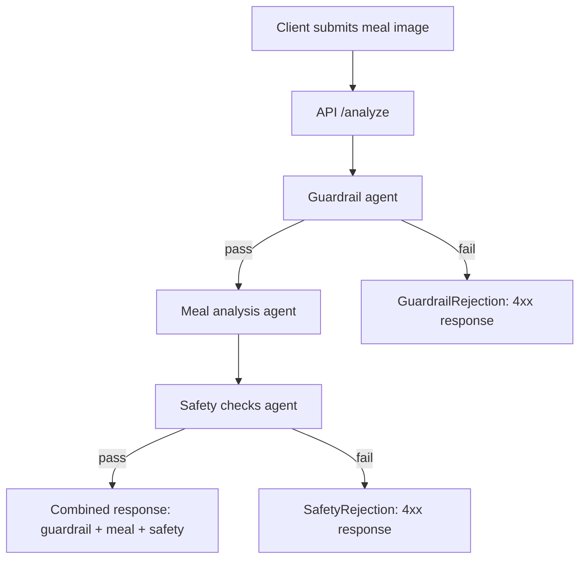

# Take-Home Report: Meal Analysis Agents

Date: 2026-03-02

## 4.1 Eval code base with README

### Eval platform chosen
Custom, in-repo Python eval harness located in `evals/`.

- The runner executes the same pipeline used by the API on image/JSON pairs in `data/`.
- Metrics are computed in `evals/metrics.py` and summarized to `data/results/eval_metrics_summary.json`.
- A rendered results table is generated at `docs/RESULTS_TABLE.md`.

### Setup instructions

1. Install dependencies

```bash
uv sync
```

2. Set your OpenAI API key

```bash
export OPENAI_API_KEY=YOUR_KEY
```

3. Run the evals pipeline (all models configured in the repo)

```bash
./scripts/run_evals_pipeline.sh
```

4. Recompute metrics from existing result files (no new API calls)

```bash
./scripts/run_evals_pipeline.sh --metrics-only
```

Outputs:
- `docs/RESULTS_TABLE.md` (rendered table)
- `data/results/eval_metrics_summary.json` (summary metrics)
- `data/results/eval_results_*.json` (per-sample results)

### Architecture diagram (agents and sequencing)



### Rationale for selected models (quality and latency)

Recommended architecture: **gpt-4o for all three agents**.

- It has the best end-to-end P50 latency (5372.4 ms) while maintaining a strong composite score (92.8).
- gpt-5.2 yields the highest composite score (94.1) but adds ~1.6 s median latency; that trade-off is not justified for the current product focus on responsiveness.
- gpt-4o-mini shows the same composite score as gpt-4o but substantially higher input token usage and worse latency.

## 4.2 Evaluation Results

### Recommended architecture summary

- Model: **gpt-4o**
- Composite Eval score: **92.8**
- P50 end-to-end latency: **5372.4 ms**

Source: `data/results/eval_metrics_summary.json` and `docs/RESULTS_TABLE.md`.

### Per-agent results tables

Notes:
- `Avg input tokens` and `Avg output tokens` are pipeline-level averages (sum of all three agents) because per-agent token usage is not currently emitted in eval outputs.
- `Eval Score` for each agent corresponds to its specific metric: guardrails %, meal %, safety %.

#### Guardrail agent

| Model | Eval Score | Avg input tokens* | Avg output tokens* | P50 latency (ms) |
| --- | --- | --- | --- | --- |
| gpt-4o | 100.0 | 1378.5 | 277.6 | 1098.4 |
| gpt-5.2 | 100.0 | 1525.5 | 360.0 | 1262.5 |
| gpt-5.1 | 100.0 | 1321.9 | 342.1 | 1596.3 |
| gpt-4o-mini | 100.0 | 17869.6 | 277.2 | 1627.5 |

#### Meal analysis agent

| Model | Eval Score | Avg input tokens* | Avg output tokens* | P50 latency (ms) |
| --- | --- | --- | --- | --- |
| gpt-4o | 94.4 | 1378.5 | 277.6 | 3354.2 |
| gpt-5.2 | 95.5 | 1525.5 | 360.0 | 4575.7 |
| gpt-5.1 | 100.0 | 1321.9 | 342.1 | 3857.0 |
| gpt-4o-mini | 97.2 | 17869.6 | 277.2 | 4383.8 |

#### Safety checks agent

| Model | Eval Score | Avg input tokens* | Avg output tokens* | P50 latency (ms) |
| --- | --- | --- | --- | --- |
| gpt-4o | 85.4 | 1378.5 | 277.6 | 675.6 |
| gpt-5.2 | 87.9 | 1525.5 | 360.0 | 1298.7 |
| gpt-5.1 | 77.8 | 1321.9 | 342.1 | 1314.2 |
| gpt-4o-mini | 80.6 | 17869.6 | 277.2 | 1653.4 |

### Key observations and how they informed decisions

- Guardrails accuracy is 100% across all models, so model choice is driven by latency and the downstream agents.
- Meal analysis is the dominant latency contributor, so we favor the model with the lowest end-to-end P50.
- Safety checks are the lowest-scoring component across models, suggesting future work should target prompt or schema improvements regardless of model.
- gpt-4o provides the best latency with a near-top composite score, so it is the recommended default for the full pipeline.

